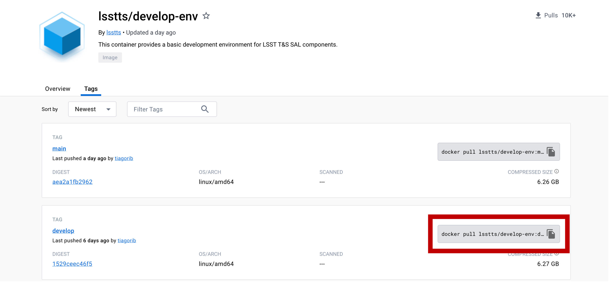
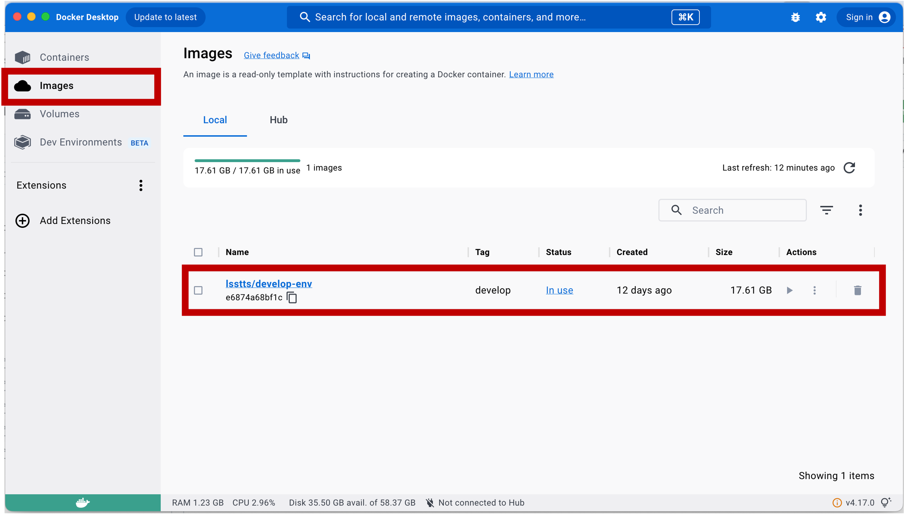
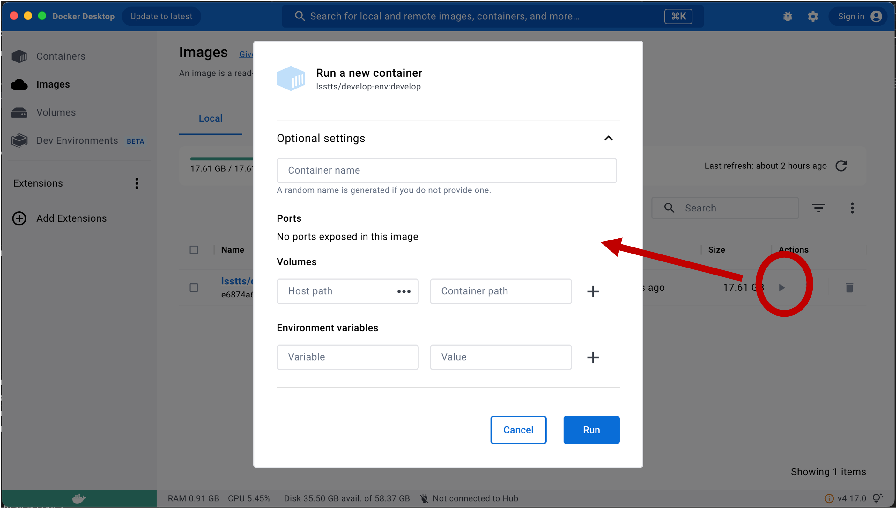
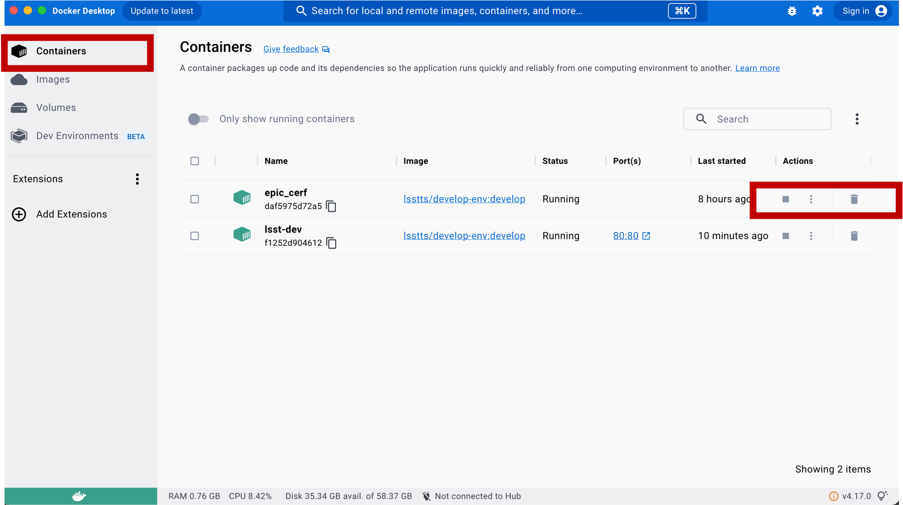
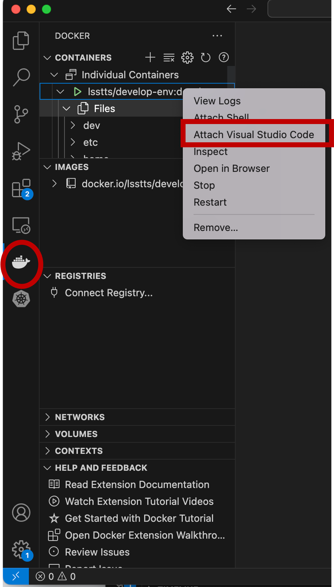
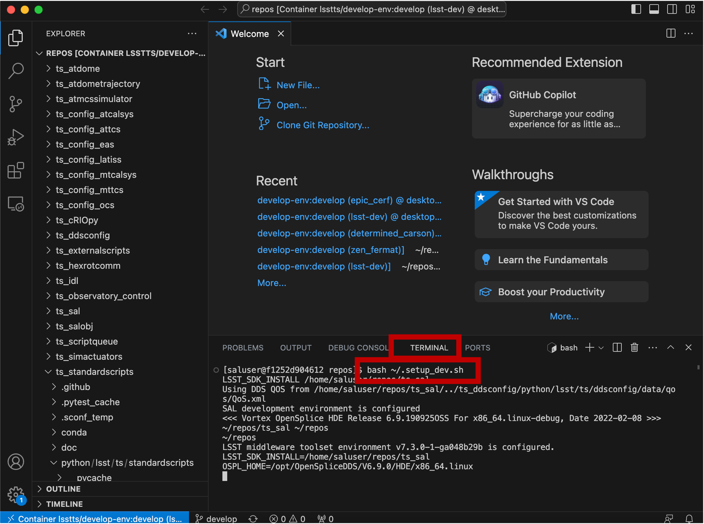
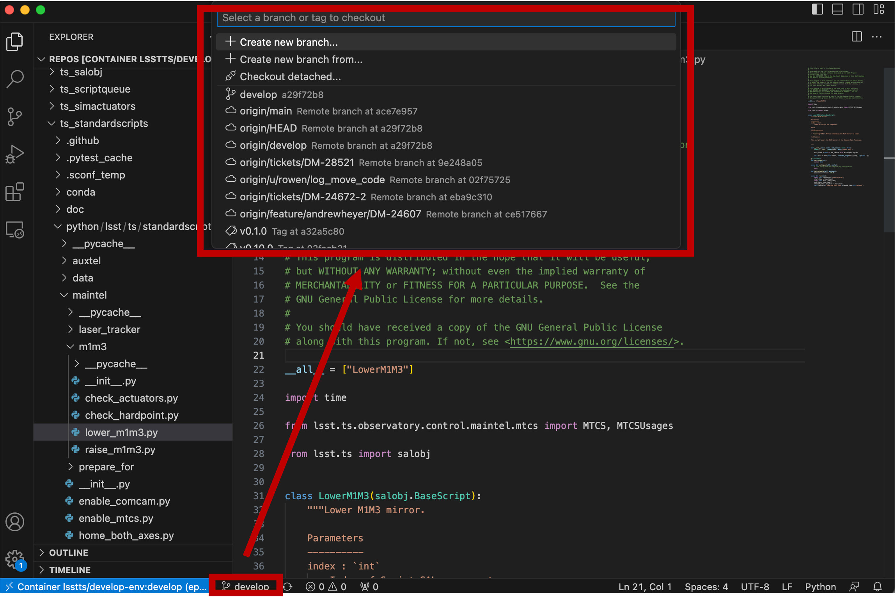
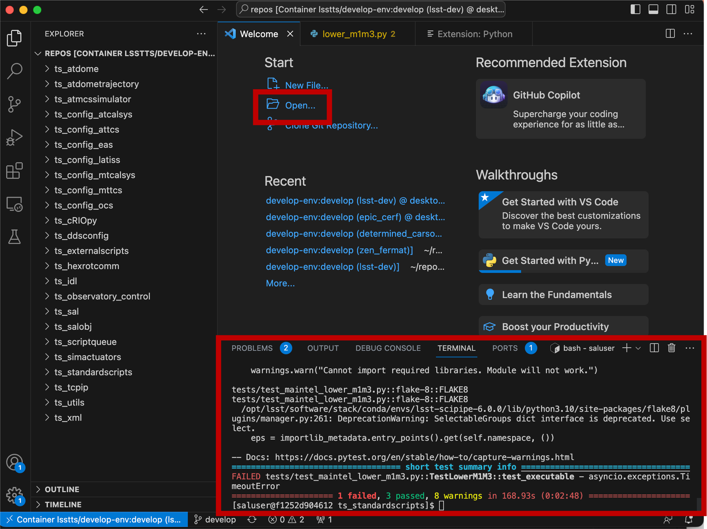

#############
Docker Guides
#############

Guides for learning how to use docker for the lsstts code developement using Visual Studio Code.

Following instructions assume you installed Docker and Visual Studio Code.

Here are some resources for learning more about Docker:

* `Docker Installation <https://www.docker.com/get-started/>`_
* `Docker Overview <https://docs.docker.com/get-started/overview/>`_

Getting LSSTTS Docker Image
============================

First, you need to download "docker image". For example, lsstts develop-env can be installed following the instructions from here: `lsstts docker image <https://hub.docker.com/r/lsstts/develop-env/tags>`_ 

You can copy the docker pull command and run it from the terminal.

Now you will see image installed in your Docker app like the image below. 

There are two ways to open the container from the image you just installed. You can click the play button to start the container, or put command in terminal to run.

When opening the container using the play button, there are options you can add. You can put container name, host, volumes, and environmental variables. If you don't give a container name, it will randomly create name for you. 

Similarly, when you run the container using the command, you can select options. For example:

::

    docker run --name lsst-dev -p 80:80 --volume ${place_where_I_save_repos}:/home/saluser/develop -it lsstts/develop-env:develop

Here "--name" is the name of the container, "-p" means port, "--volume" as volumne, where you saved your repo, and "-it" as the image you are using.
Name your repo path as "/home/saluser/develop" to reduce confusion.
Basic idea of giving "--volume" and "-it" is that you are creating container based on the "image", and also making it to connect to your repo, which can be the git cloned repository.
This way you can make the container and repo to communicate, testing runs in the container, update your repo by copying or movnig the files from the container, and then you can push your local repository to the origin.

The containers created will show up when you click "containers" on the left side of the docker desktop as below. You can stop, or delete the containers with the icons. 

Opening Docker in Visual Studio Code
=====================================
Visual Studio Code makes it easier to use docker environment literally more visual, and straight forward to understand. It helps you to find the files like a finder, to let you able to open the files from double clicking. 

When you open the Visual Studio Code and go to the docker icon (whale shape) on the left column, you will see the list of images installed and containers you opened.  

Right click while pointing on the container you want to use, and select "attach Visual Studio Code". It will open your container into the new window.

In the local terminal where you just ran the command to open the container, or from the terminal in the visual studio code, run ::
    
    source ~/.setup_dev.sh

Then go to your repo, which you put into the "--volume", ::
    
    cd /home/saluser/develop/(path_to_repos)/ts_standardscripts

then run following commands::
    
    setup -r .
    eups list

You should see something like this::

    ...
    ts_scriptqueue        tag:current       current setup
    ts_simactuators       tag:current       current setup
    ts_standardscripts    LOCAL:/home/saluser/develop/lsst-ts/ts_standardscripts    setup
    ts_standardscripts    tag:current       current
    ts_tcpip              tag:current       current setup
    ... 

This means that you are using your version of the ts_standardscripts instead of the one that comes with the docker image.

Also if you are in /home/saluser/develop, ::

    $ eups declare -r ~/tsrepos/ts_standardscripts/ -t $USER
    $ setup ts_standardscripts -t $USER
    $ eups list ts_standardscripts
    
      tag:current 	current
      tag:saluser 	saluser setup

This way you do only for the one you want to use to replace the default package that comes with the docker image.

Switching branch in Visual Studio Code
=======================================

In visual studio code, you can also switch branch from the bottom of the window as shown in the image below. 
Click the branch icon, and all the branches will appear on the top box where it was the search box previously.

You will NOT see the branches that are up-to-date in git hub because the container is made from the image, and the image is not necesarrily following up with the git hub repository. 
This is where the repo you called from "--volume" is needed. 

The container default repository is::

    /home/saluser/repos/

while repo is under as you declared in "--volume"::

    /home/saluser/develop/

Open and edit the scripts in Visual Studio Code
=================================================

Now your environment is ready. 
You can open and edit the script from clicking the file on the left pannel. 
You can run the files under the /home/saluser/develop/ in terminal (bottom red box in the following image). 
For example, if you run test code, you can quickly check if your code will pass or fail under the environment.

    How to open the files, or run the script (ex. test code) in VSCode

If you want to work with github branch in your container, you can clone the git repository as well, clicking *Clone Git Repository* and put the URL of the git repository you want to clone.

.. image:: ../../../images/branch_git_repo.png
  :width: 700px
  

Remember, once you close and delete the container, changes made in the container are not saved nor updating original image files. Therefore, changes should be copied and saved in local repo (--volume). 

Useful links
=============

* `Writing-Sal-Scripts <https://obs-controls.lsst.io/Control-User-Interfaces/writing-sal-scripts.html>`_