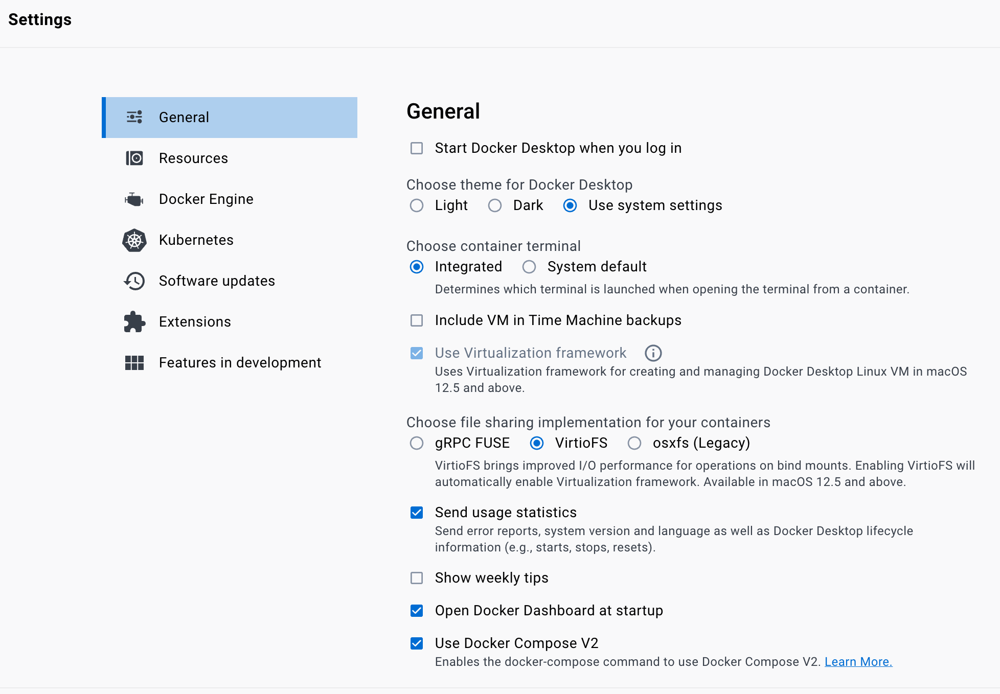
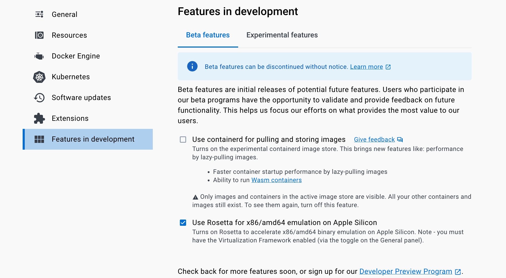

################################
Docker for development on Mac M1
################################

Most of these instructions are valid for any docker based development in but the M1 has a couple of special requirements. 

Install and setup Docker
========================
Install docker by e..g downloading the install from `the docker website <https://www.docker.com/products/docker-desktop/>`_

Once you have docker desktop running open the settings (Cmd ,)

- In the General settings make sure 'VirtioFS' is selected. 

- In the Features in Development settings select 'Use Rosetta for X86/amd64 emulation on Apple Silicon'

Running the container
=====================

The `develop` tag indicates the most recent container that should be used for development.
The development container is `develop-env`.
On Mac M1 to avoid a warning add `--platform linux/amd64`.
Naming the container is useful for logging in and finding it later.
The '-v' option may be used to mount a local directory into the container - keeping all you checkouts in a folder outside is useful if you want to use an IDE for editing.

So a command to spin up a container and put you on the command prompt would look like (with output) :

.. code-block:: sh
    $ docker run --platform linux/amd64 --privileged --name sal --rm  -v ${HOME}/LSSTcode/TSS:/home/saluser/develop -it lsstts/develop-env:develop
    LSST_SDK_INSTALL /home/saluser/repos/ts_sal
    Using DDS QOS from /home/saluser/repos/ts_sal/../ts_ddsconfig/python/lsst/ts/ddsconfig/data/qos/QoS.xml
    SAL development environment is configured
    <<< Vortex OpenSplice HDE Release 6.9.190925OSS For x86_64.linux-debug, Date 2022-02-08 >>>
    ~/repos/ts_sal ~
    ~
    LSST middleware toolset environment v7.2.0-4-g2e9da550 is configured.
    LSST_SDK_INSTALL=/home/saluser/repos/ts_sal
    OSPL_HOME=/opt/OpenSpliceDDS/V6.9.0/HDE/x86_64.linux
    [saluser@4f8cd5447d04 ~]$ 

From there you are ready to conda install or setup up any packages you need. 

Stable containers and other tags
++++++++++++++++++++++++++++++++

There are many alternatives to the `develop` tag for container - specifically the per cycle container is useful. 
Cycles are listed `here on confluence <https://confluence.lsstcorp.org/display/LSSTCOM/Software+Upgrades>`.

The `develop-env tags on DockerHub are listed here <https://hub.docker.com/r/lsstts/develop-env/tags>`. 
Specific cycle containers are labeled `cCCCC.VVV`, where `CCCC` is  the cycle number (e.g. 0028) and `VVV` is version (e.g. 004). 
So to get specifically c0029,  use:

.. code-block:: sh
    lsstts/develop-env:c0028.004

in the docker run command above. 
